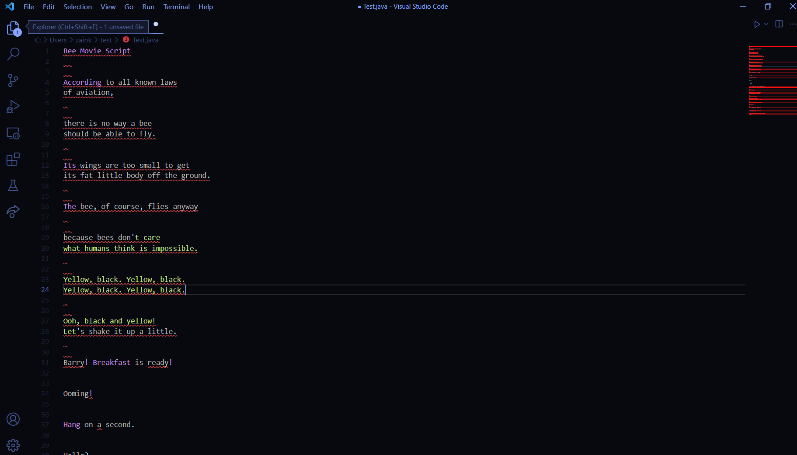
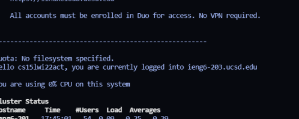
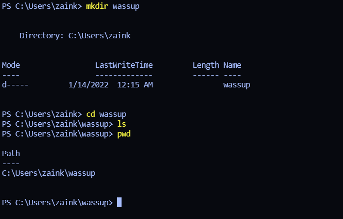
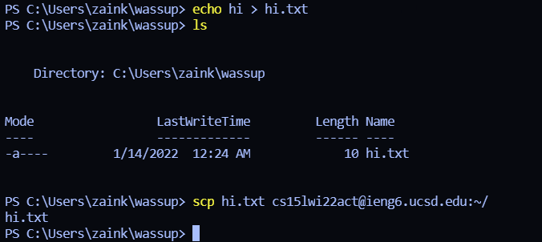
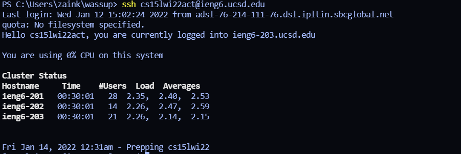
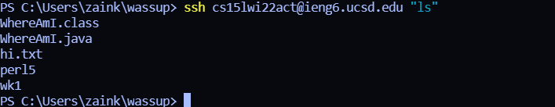

# Lab 1 Report CSE 15L

***

This is a quick tutorial on how to log into a course-specific account on ieng6. 

**Installing VScode**

The first step, we need to ensure we have downloaded VSCode. 

[Use this link if you don't have it.](https://code.visualstudio.com/) 

Once it's installed, and after installing a completely necessary new theme, it should look something like this. 

**Remotely Connecting**

Next we, can connect remotely by using the command  *ssh cs15lwi22zz@ieng6.ucsd.edu*

Instead of the *zz*, replace it with your personal account letters. 

Click yes when prompted, and you should be connected!

**Trying Some Commands**

Here are some useful commands to know

* cd - changes the working directory
* ls- lists all the file in the current directory
* pwd- shows the current working directory
* mkdir- makes a new directory
* cp- copies the argument provided

**Moving Files with scp**

One notable command is scp. It allows us to move files to the server directly from the client. Let's try it by moving a file over to the server. 

**Setting an SSH Key**

It's a little bit annoying that it keeps asking for us to keep entering our password, let's make it so that it automatically remembers us. Generate a ssh key with the command ssh-keygen. Now, log into the server, make a new dir called .ssh, and run the following command - scp /Users/(your username)/.ssh/id_rsa.pub cs15lwi(your characters)@ieng6.ucsd.edu:~/.ssh/authorized_keys. Now, you should be able to login without a password!

**Optimizing Remote Running**

There's some even cooler tricks we can use! To run something directly on a server, we can put a command in quotes after ssh-ing into the client. 

We can also run multiple commands on the same line by seperating them with semicolons. To use the previously used command, we can just up arrow. 

---

Hopefully now, you are basically an expert at logging into course-specefic accounts on ieng6. Remember, with great power comes great responsibility.  

