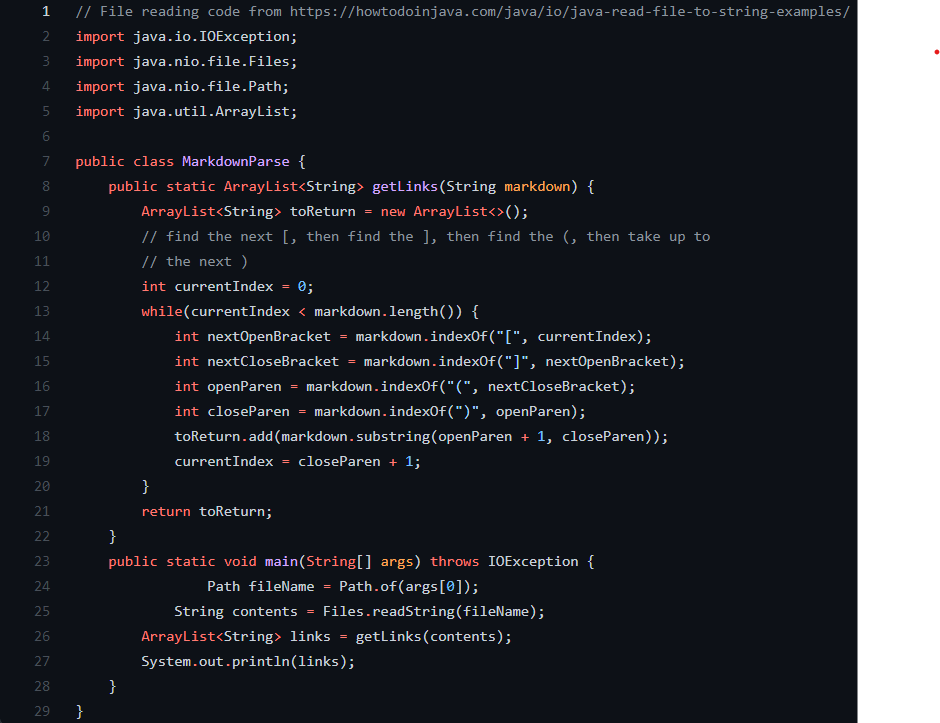
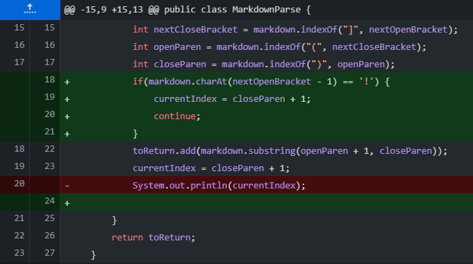

# Lab 2 Report CSE 15L

***

In this lab, we worked with a file *MarkdownParse.java*, which attempted to parse a Markdown file and print out all the links in the file. If you are curious, this is what it looks like. 



Unfortunately, this code doesn't do exactly what we want. Let's try and find ways we can break this code, and then fix it!

For starters, it looks like this code is not differentiating between links and images. Let's try and running MarkdownParse on this file to test this theory -  [image.md](https://raw.githubusercontent.com/TheZenMasterz/markdown-parse/main/image.md)

When we run the command(after compiling MarkdownParse.java), ```java MarkdownParse image.md```, our program prints out ```[google.com, pic.png]```. We don't wan't it to print out pic.png, so it looks like we were right. 

Now, we need some way to be able to differentiate between links and images. Lucky for us, there is a ! in front of the open bracket for images. All we need to do in our program is, before we add something to our array of links, we check to see if it has that ! before the open bracket, and if it does, don't add it to the array. 



In this case, the bug was the program not checking if what it was adding to the array of links was an image. The bug resulted in the symptom that the program outputting images as links. We could produce this symtom by inputting in a markdown file with an image. 

