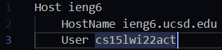
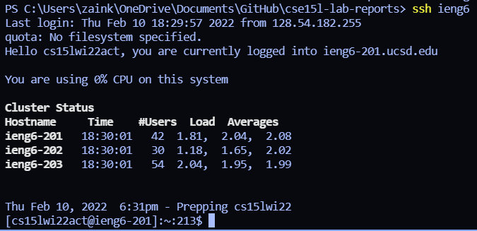

# Lab 3 Report CSE 15L

***

Let's walk through how to streamline an ssh configuration. Let's start off by creating a file called config(doesn't matter what our working directory is). I personally created it using VSCode, but you are welcome to do so however you please. The config file should look like this, except with your unique username instead of mine!



Now, let's get this config file into the correct directory. Copy this command into your terminal. 

```mv config ~/.ssh/config```

Alright, time to test it! Let's try accessing the server this time with the command ```ssh ieng6```. 



Looks like it works! Now, let's use ```scp``` to copy a file to our account using our alias. Let's first create a file to move. I used the command ```echo "Hi" > tryingToMove``` to create a file tryingToMove. 


Looks good! Log in again, make sure your file was actually moved there(maybe use ```ls```), and you are now an expert at this!