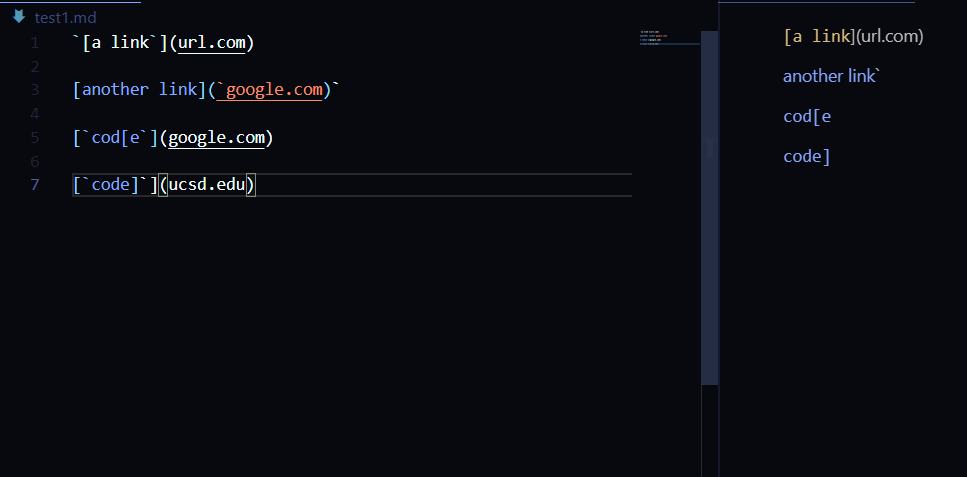
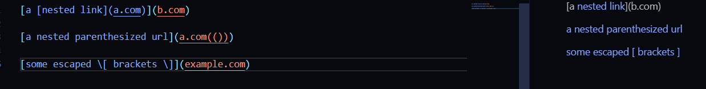

# Lab 4 Report CSE 15L

***

Let's try running a couple tests on our MarkdownParse.java and the one we reviewed in class to see how they compare! Our repository is https://github.com/TheZenMasterz/markdown-parse and the one we reviewed is  https://github.com/ericwpei/markdown-parse. 

Let's start with our first test! This is what our test file/it's preview looks like- 



So, we should expect those 3 links to be returned by the getLinks function. This the test I have added to both MarkdownParseTest.java. 


Our repository fails the test and the JUnit test outputs this ```java.lang.AssertionError: expected:<[`google.com, google.com, ucsd.edu]> but was:<[url.com, `google.com, google.com, ucsd.edu]>```. The other repository has the same exact output for this test case. 

To fix this error, we likely just need to add a check to see if an unclosed backtick occurs before a bracket, which means we should not add a link. 

Onto the second test! This is what our test file/it's preview looks like- 



So, we should expect those links to be returned by the getLinks function. This the test I have added to both MarkdownParseTest.java. 


Our repository fails the test as well and the JUnit test outputs this ```java.lang.StringIndexOutOfBoundsException: String index out of range: -1```. 

This is not as easy of a fix because we would have to change a lot of how our program works to ensure that when we are looking at the next bracket or paretheses, it is not nested inside something else. 

The other repository's JUnit test outputs ```java.lang.AssertionError: expected:<[a.com, a.com(()), example.com]> but was:<[a.com, example.com]>```

Home stretch now! Let's try the third and final test. This is what our test file/it's preview looks like- 


So, we should expect those links to be returned by the getLinks function. This the test I have added to both MarkdownParseTest.java. 


Once again, we fail this test as well. This is what the JUnit test outputs-  ```java.lang.StringIndexOutOfBoundsException: String index out of range: -1```

One clear issue is that the our program is not able to find the correct closing paretheses, which is resulting in an out of bounds error. Once again, this is likely a big change that would require restructuring our entire code. 
