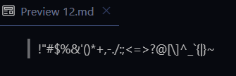
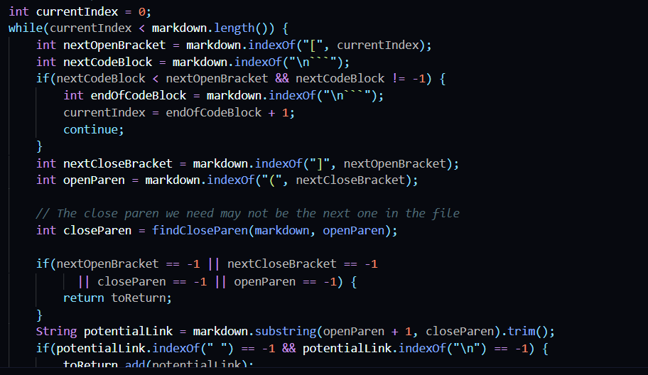
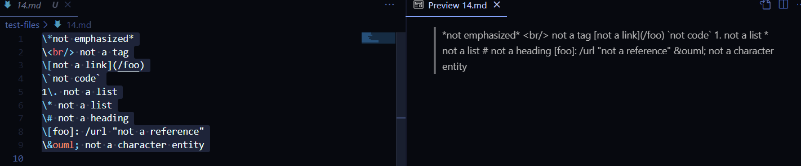

# Lab 5 Report CSE 15L

***

Let's try and compare our MarkdownParse with the one in this repository- https://github.com/ucsd-cse15l-w22/markdown-parse. Let's choose two tests and see how the two implemtations compare, and which, if either, are correct. To find md files in test-files that are different, I took the output from script.sh that we used on Lab 9 on both repositories, and I compared it using [text-compare](test-compare.com). This made it visually extremely easy to see where the differences were. 

The first test file where we found a difference was 12.md. It looked like this ```\!\"\#\$\%\&\'\(\)\*\+\,\-\.\/\:\;\<\=\>\?\@\[\\\]\^\_\`\{\|\}\~```. VSCode Preview shows that there are no links in this file. 



Unfortunately, our MarkdownParse ran into an infinite loop. On the other hand, the other MarkdownParse correctly returned ```[]```. Unfortunarely, the way we wrong our MarkdownParse.java, if we don't encounter a character we are expecting to encounter, we reset current index to -1. We can change it by adding a check for if something returned -1, we can just return our links as there will be no more links.  



Another test that we are getting different outputs for is 14.md. It looks like this with it's respective preview. 

. 

As you can see it should have no links. Again we are running into the same issue where our implementation runs into an infinite loop while theirs correctly returns an empty list. Implementing the same fix from the previous test file should solve this issue!